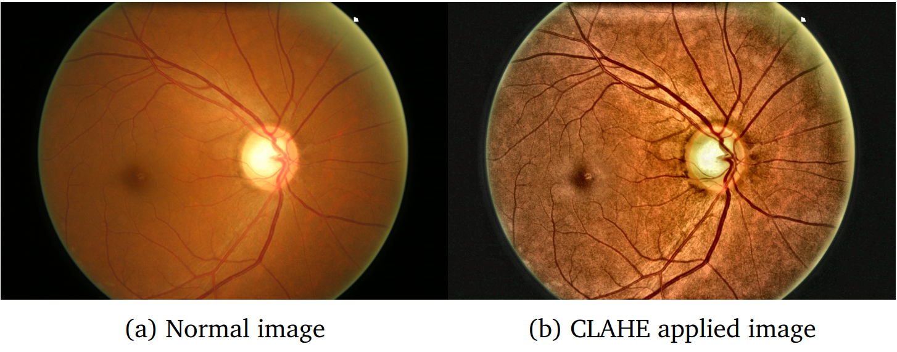

# eye-disease-prediction

The classification of Glaucoma, Diabetic Retinopathy and Normal eyes by Support Vector Machine, Random Forest and Logistic Regression is carried out in this project. Before training the models, the images went through some basic image enhancements and preprocessing.

### `Dataset:`
Three different datasets were used:
1. [Glaucoma Dataset](https://www.kaggle.com/sshikamaru/glaucoma-detection)
2. [Diabetic Retinopathy](https://www.kaggle.com/sohaibanwaar1203/diabetic-rateinopathy-full)
3. [1000 fundus images with 39 categories](https://www.kaggle.com/linchundan/fundusimage1000)

### `Preprocessing:`
* Contrast Limited Adaptive Histogram Equalization **(CLAHE)** was used to enhance image quality.
  #### `Effect of applying CLAHE`
  

* After that, the images were resized and **sobel filter** was applied on the images so that the optic nerves could be identified.
  #### `Effect of applying sobel filter`
  

### `Experiments:`
Two experiments were carried out using the same machine learning approaches. There were three classes for each experiment:
1. Glaucoma Positive
2. Diabetic Retinopathy Positive
3. Other/ Normal

These were classified using the following machine learning algorithms:
1. Support Vector Machine (SVM)
2. Random Forest
3. Logistic Regression

Experiment A involved the 'Normal' class having the 'non-Glaucoma' and 'non-Diabetic Retinopathic' images, which was not a good option as these images may have contained other diseases.

So, Experiment B was conducted having only healthy images from a different dataset.

### `Comperative Results:`

### `Resources:`
[This](https://github.com/bnsreenu/python_for_microscopists) repository of Dr. Sreenivas Bhattiprolu and his [YouTube Channel](https://www.youtube.com/channel/UC34rW-HtPJulxr5wp2Xa04w) has helped me a lot in understanding and implementing this classification task.